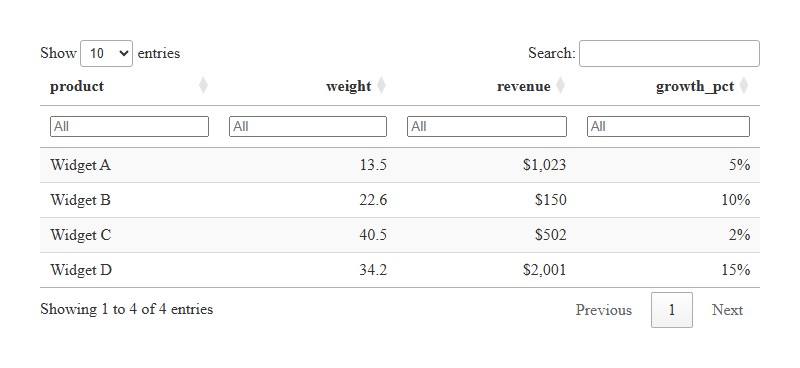
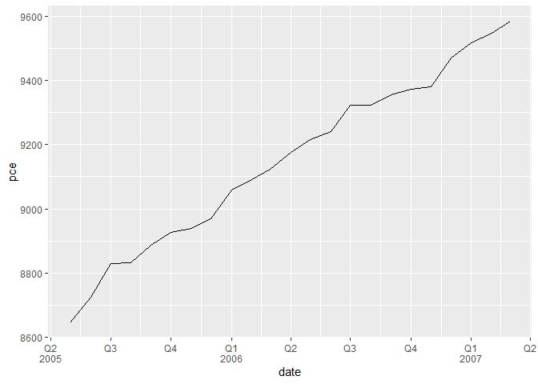

<!-- README.md is generated from README.Rmd. Please edit that file -->

# mcrutils

<!-- badges: start -->

[](https://app.codecov.io/gh/mcaselli/mcrutils)
[](https://github.com/mcaselli/mcrutils/actions/workflows/R-CMD-check.yaml)
<!-- badges: end -->

The goal of mcrutils is to provide a grab-bag of utility functions that
I find useful in my own R projects for data cleaning, analysis, and
reporting, including creating and visualizing year-to-date and quarterly
analyses.

## Installation

You can install the development version of mcrutils from
[GitHub](https://github.com/) with:

``` r
# install.packages("pak")
pak::pak("mcaselli/mcrutils")
```

## Examples

### Data cleaning

For data frames or tibbles that have character or factor columns storing
logical data, as may happen when reading from a database, CSV, or Excel
file, use `normalize_logicals()` to find and convert these columns to
logical type. This is a nice one-liner in a `dplyr` pipe

``` r
library(mcrutils)
library(dplyr, warn.conflicts = FALSE)

ugly_data <- tibble(
  logical_char = c("T", "F", "T"),
  logical_factor = factor(c("TRUE", "FALSE", "TRUE")),
  non_logical_char = c("a", "b", "c"),
  non_logical_factor = factor(c("x", "y", "z")),
  mixed_char = c("T", "F", "a"),
  mixed_factor = factor(c("TRUE", "FALSE", "x")),
  numeric_col = c(1.1, 2.2, 3.3)
)


ugly_data |> normalize_logicals()
#> Converted "logical_char" and "logical_factor" columns to logical.
#> # A tibble: 3 × 7
#>   logical_char logical_factor non_logical_char non_logical_factor mixed_char
#>   <lgl>        <lgl>          <chr>            <fct>              <chr>     
#> 1 TRUE         TRUE           a                x                  T         
#> 2 FALSE        FALSE          b                y                  F         
#> 3 TRUE         TRUE           c                z                  a         
#> # ℹ 2 more variables: mixed_factor <fct>, numeric_col <dbl>
```

### Year-to-date helpers

`mcrutils` provides a handful functions that can be helpful in creating
year-to-date analyses

Below we have 2.5 years of historical sales data ending on June 1, 2025.
It’s trivial to calculate the total sales grouped by year:

``` r
set.seed(123)
sales <- tibble(
  date = seq(
    from = as.Date("2023-01-01"),
    to = as.Date("2025-06-01"),
    by = "month"
  ),
  amount = rpois(30, lambda = 100)
)

head(sales)
#> # A tibble: 6 × 2
#>   date       amount
#>   <date>      <int>
#> 1 2023-01-01     94
#> 2 2023-02-01    111
#> 3 2023-03-01     83
#> 4 2023-04-01    101
#> 5 2023-05-01    117
#> 6 2023-06-01    104

sales |>
  group_by(year = lubridate::year(date)) |>
  summarise(annual_sales = sum(amount))
#> # A tibble: 3 × 2
#>    year annual_sales
#>   <dbl>        <int>
#> 1  2023         1199
#> 2  2024         1166
#> 3  2025          600
```

`is_ytd_comparable()` is a logical vector that indicates whether the
dates in a vector are within a year-to-date period relative to a given
`end_date`.

So we can quickly filter the historical data to see how we’re doing in
2025 compared to the same period (i.e. January - June) in 2023 and 2024:

``` r
(bounds <- ytd_bounds(sales$date))
#> [1] "2025-01-01" "2025-06-01"

sales |>
  filter(is_ytd_comparable(date, max(bounds))) |>
  group_by(year = lubridate::year(date)) |>
  summarise(ytd_sales = sum(amount))
#> # A tibble: 3 × 2
#>    year ytd_sales
#>   <dbl>     <int>
#> 1  2023       610
#> 2  2024       594
#> 3  2025       600
```

### one-line datatables

`auto_dt()` is a one-line function that creates a `DT::datatable` object
from a data frame or tibble, and applies percent, currency, and round
formatting to numeric columns, guessing the correct format from the data
type and column names. The datatable has filters at the top and no
rownames.

``` r
tribble(
  ~product, ~weight, ~revenue, ~growth_pct,
  "Widget A", 13.53, 1023.21, 0.051,
  "Widget B", 22.61, 150.24, 0.103,
  "Widget C", 40.54, 502.26, 0.021,
  "Widget D", 34.21, 2000.95, 0.154
) |>
  mutate(product = as.factor(product)) |>
  auto_dt(numeric_digits = 1, pct_digits = 0)
```



`vignette("mcrutils")` has more examples, including how to specify the
set of strings that flag a column as percentage or currency.

### Quarterly breaks and labels

`scales::label_date_short()` is a great function for labeling dates in
`ggplot2`, but unfortunately it can’t support quarterly breaks and
labels out of the box.

`label_quarters_short()` generates similar labels for quarterly date
breaks, labeling every quarter, but only including the year when it
changes from the previous label. `breaks_quarters()` generates quarterly
breaks for date scales.

``` r
library(ggplot2)

economics |>
  filter(date >= "2005-05-01", date <= "2007-03-01") |>
  ggplot(aes(date, pce)) +
  geom_line() +
  scale_x_date(
    breaks = breaks_quarters(),
    labels = label_quarters_short()
  ) 
```



By default, `breaks_quarters()` tries to return a reasonable number of
breaks over a wide range of dates, down-sampling to semesters and years
as needed. See `vignette("mcrutils")` for more examples.
