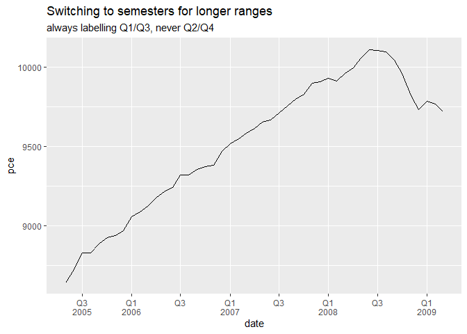
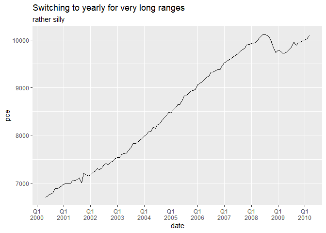
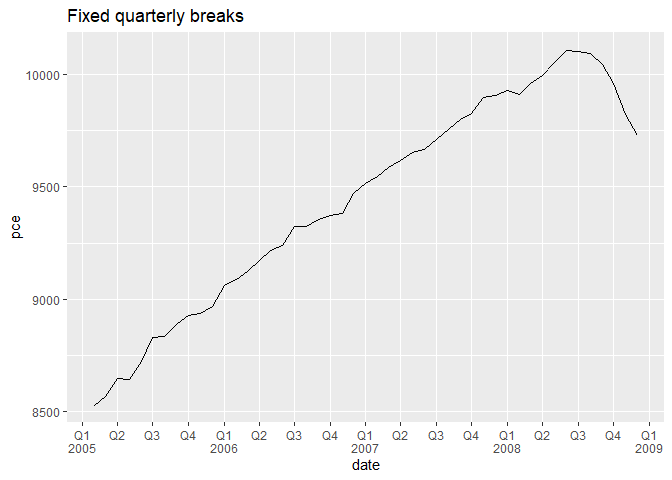

<!-- README.md is generated from README.Rmd. Please edit that file -->

# mcrutils

<!-- badges: start -->

[](https://app.codecov.io/gh/mcaselli/mcrutils)
[](https://github.com/mcaselli/mcrutils/actions/workflows/R-CMD-check.yaml)
<!-- badges: end -->

The goal of mcrutils is to …

## Installation

You can install the development version of mcrutils from
[GitHub](https://github.com/) with:

``` r
# install.packages("pak")
pak::pak("mcaselli/mcrutils")
```

## Examples

### Data cleaning

For data frames or tibbles that have character or factor columns storing
logical data, as may happen when reading from a database, CSV, or Excel
file, use `normalize_logicals()` to find and convert these columns to
logical type. This is a nice one-liner in a `dplyr` pipe

``` r
library(mcrutils)
library(dplyr)
#> 
#> Attaching package: 'dplyr'
#> The following objects are masked from 'package:stats':
#> 
#>     filter, lag
#> The following objects are masked from 'package:base':
#> 
#>     intersect, setdiff, setequal, union

ugly_data <- tibble(
  logical_char = c("T", "F", "T"),
  logical_factor = factor(c("TRUE", "FALSE", "TRUE")),
  non_logical_char = c("a", "b", "c"),
  non_logical_factor = factor(c("x", "y", "z")),
  mixed_char = c("T", "F", "a"),
  mixed_factor = factor(c("TRUE", "FALSE", "x")),
  numeric_col = c(1.1, 2.2, 3.3),
  stringsAsFactors = FALSE
)


ugly_data |> normalize_logicals()
#> Converted "logical_char" and "logical_factor" columns to logical.
#> # A tibble: 3 × 8
#>   logical_char logical_factor non_logical_char non_logical_factor mixed_char
#>   <lgl>        <lgl>          <chr>            <fct>              <chr>     
#> 1 TRUE         TRUE           a                x                  T         
#> 2 FALSE        FALSE          b                y                  F         
#> 3 TRUE         TRUE           c                z                  a         
#> # ℹ 3 more variables: mixed_factor <fct>, numeric_col <dbl>,
#> #   stringsAsFactors <lgl>
```

### Year-to-date helpers

`mcrutils` provides a handful functions that can be helpful in creating
year-to-date analyses

With `ytd_bounds()`, quickly find the date bounds of the latest
year-to-date period in vector of dates, possibly spanning multiple
years:

``` r
c(
  "2023-01-01", "2023-06-15", "2023-12-31",
  "2024-01-01", "2024-03-15", "2024-07-15"
) |>
  as.Date() |>
  ytd_bounds()
#> [1] "2024-01-01" "2024-07-15"
```

`is_ytd_comparable()` is a logical vector that indicates whether the
dates in a vector are within a year-to-date period relative to a given
`end_date`.

Below we have 2.5 years of historical sales data ending on June 1, 2025.
How were the sales in the comparable period of 2024 and 2023?

``` r
library(dplyr)

set.seed(123)
sales <- data.frame(
  date = seq(
    to = as.Date("2025-06-01"),
    by = "month",
    length.out = 30
  ),
  amount = rpois(30, lambda = 100)
)

head(sales)
#>         date amount
#> 1 2023-01-01     94
#> 2 2023-02-01    111
#> 3 2023-03-01     83
#> 4 2023-04-01    101
#> 5 2023-05-01    117
#> 6 2023-06-01    104

sales |>
  group_by(year = lubridate::year(date)) |>
  summarise(annual_sales = sum(amount))
#> # A tibble: 3 × 2
#>    year annual_sales
#>   <dbl>        <int>
#> 1  2023         1199
#> 2  2024         1166
#> 3  2025          600
```

How were the year-to-date sales in the comparable period of 2024 and
2023?

``` r
(bounds <- ytd_bounds(sales$date))
#> [1] "2025-01-01" "2025-06-01"

sales |>
  filter(is_ytd_comparable(date, max(bounds))) |>
  group_by(year = lubridate::year(date)) |>
  summarise(ytd_sales = sum(amount))
#> # A tibble: 3 × 2
#>    year ytd_sales
#>   <dbl>     <int>
#> 1  2023       610
#> 2  2024       594
#> 3  2025       600
```

With `py_dates()` you can rollback a vector of dates to the same period
in the previous year, moving any fictitious dates to the prior valid
day.

``` r
c("2024-01-01", "2024-02-29", "2025-07-15") |>
  as.Date() |>
  py_dates()
#> [1] "2023-01-01" "2023-02-28" "2024-07-15"
```

### one-line datatables

`auto_dt()` is a one-line function that creates a `DT::datatable` object
from a data frame or tibble, and applies percent, currency, and round
formatting to numeric columns, guessing the correct format from the data
type and column names. The datatable has filters at the top and no
rownames.

``` r
tribble(
  ~product, ~weight, ~revenue, ~growth_pct,
  "Widget A", 13.53, 1023.21, 0.051,
  "Widget B", 22.61, 150.24, 0.103,
  "Widget C", 40.54, 502.26, 0.021,
  "Widget D", 34.21, 2000.95, 0.154
) |>
  mutate(product = as.factor(product)) |>
  auto_dt(numeric_digits = 1, pct_digits = 0)
```


### Quarterly breaks and labels

`scales::label_date_short()` is a great function for labeling dates in
`ggplot2`, but unfortunately it can’t support quarterly breaks and
labels out of the box.

`mcrutils` provides a set of functions to create quarterly breaks and
labels for date scales in `ggplot2`. The `breaks_quarters()` function
generates breaks for quarters, and `label_quarters_short()` generates
minimal labels for these breaks in a two-line format (like
`scales::label_date_short()`), labeling every quarter, but only
including the year when it changes from the previous label.

``` r
library(ggplot2)

economics |>
  filter(date >= "2005-02-01", date <= "2007-03-01") |>
  ggplot(aes(date, pce)) +
  geom_line() +
  scale_x_date(
    breaks = breaks_quarters(),
    labels = label_quarters_short()
  ) +
  labs(title="Automatic Quarterly Breaks",
       subtitle ="with concise labels") +
  theme(panel.grid.minor.x = element_blank())
```


The automatic version of `breaks_quarters()` tries to return a
reasonable number of breaks over a wide range of dates, down-sampling to
semesters and years as needed.

``` r
economics |>
  filter(date >= "2005-05-01", date <= "2009-03-01") |>
  ggplot(aes(date, pce)) +
  geom_line() +
  scale_x_date(
    breaks = breaks_quarters(),
    labels = label_quarters_short()
  ) +
  labs(title="Switching to semesters for longer ranges",
       subtitle = "always labelling Q1/Q3, never Q2/Q4") +
  theme(panel.grid.minor.x = element_blank())
```



``` r
economics |>
  filter(date >= "2000-05-01", date <= "2010-03-01") |>
  ggplot(aes(date, pce)) +
  geom_line() +
  scale_x_date(
    breaks = breaks_quarters(),
    labels = label_quarters_short()
  ) +
  labs(title="Switching to yearly for very long ranges",
       subtitle = "rather silly") +
  theme(panel.grid.minor.x = element_blank())
```



With very long date ranges like this, you are likely better off
switching from these quarterly functions to the more standard date
breaks and labels in `ggplot2`:

You can force a fixed break width:

``` r
economics |>
  filter(date >= "2005-02-01", date <= "2008-12-01") |>
  ggplot(aes(date, pce)) +
  geom_line() +
  scale_x_date(
    breaks = breaks_quarters(width = "3 months"),
    labels = label_quarters_short()
  ) +
  labs(title="Fixed quarterly breaks") +
  theme(panel.grid.minor.x = element_blank())
```


