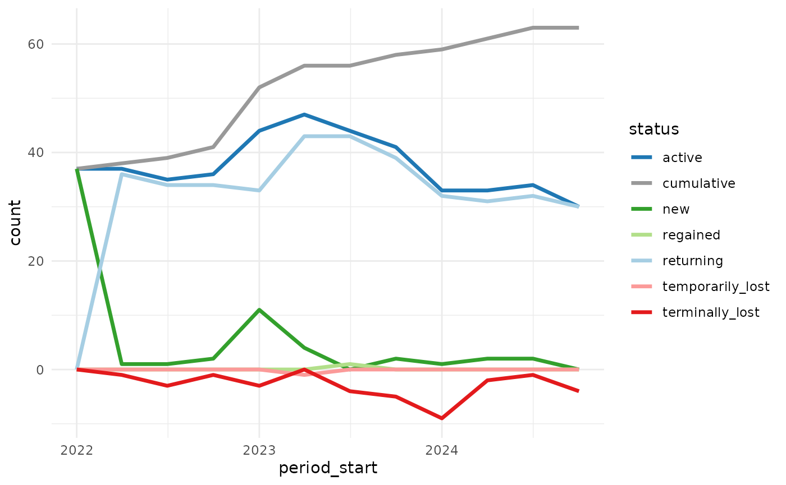
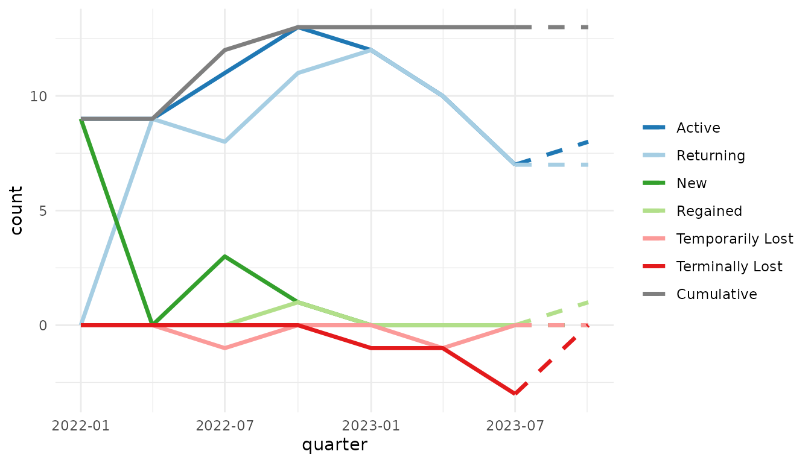
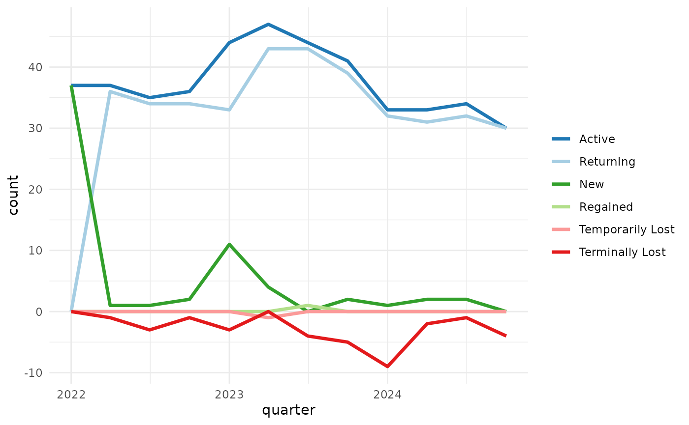
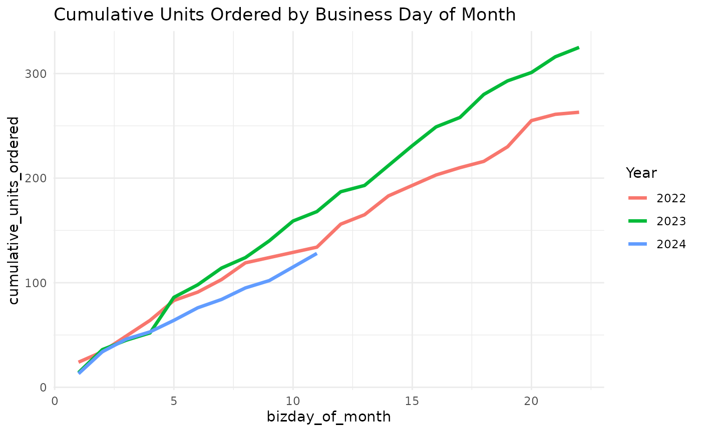
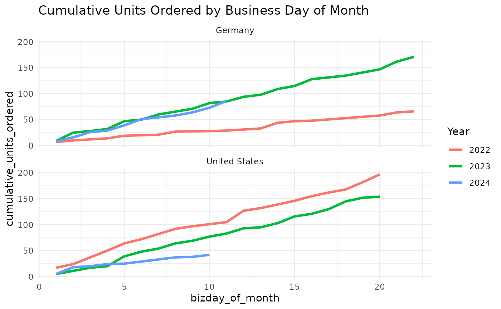
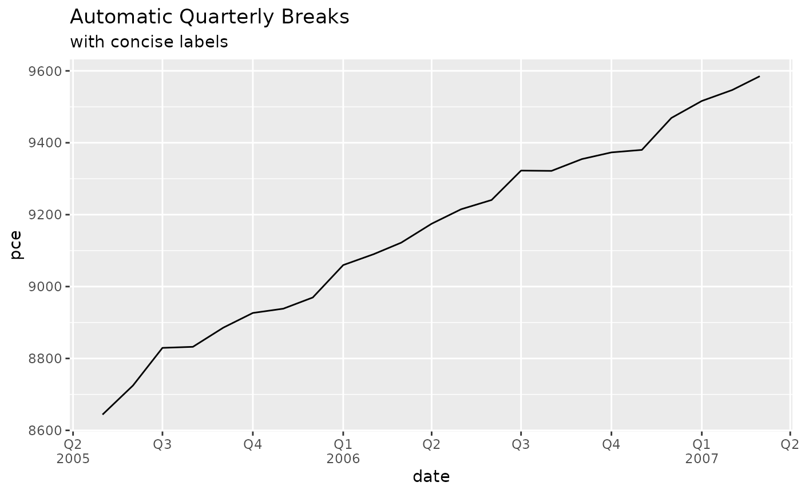
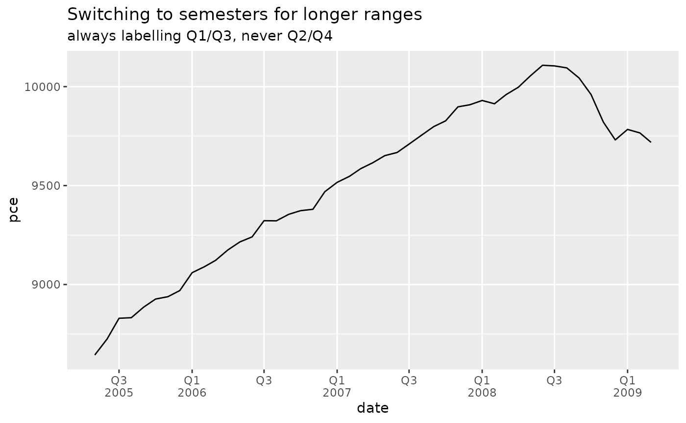
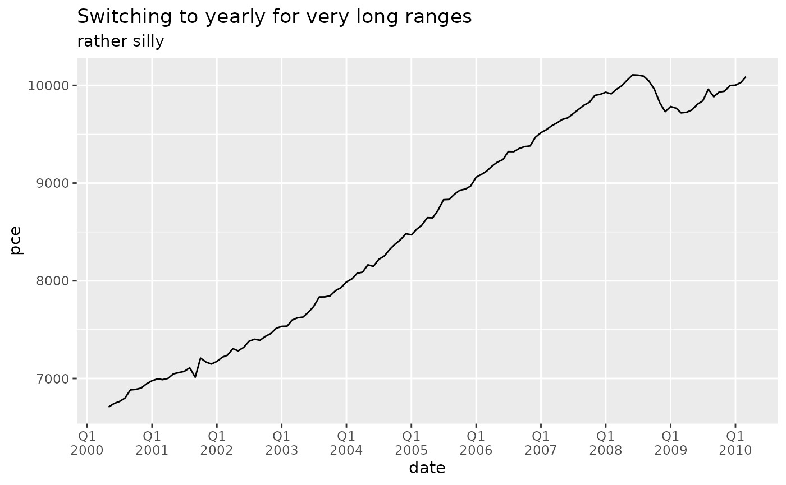
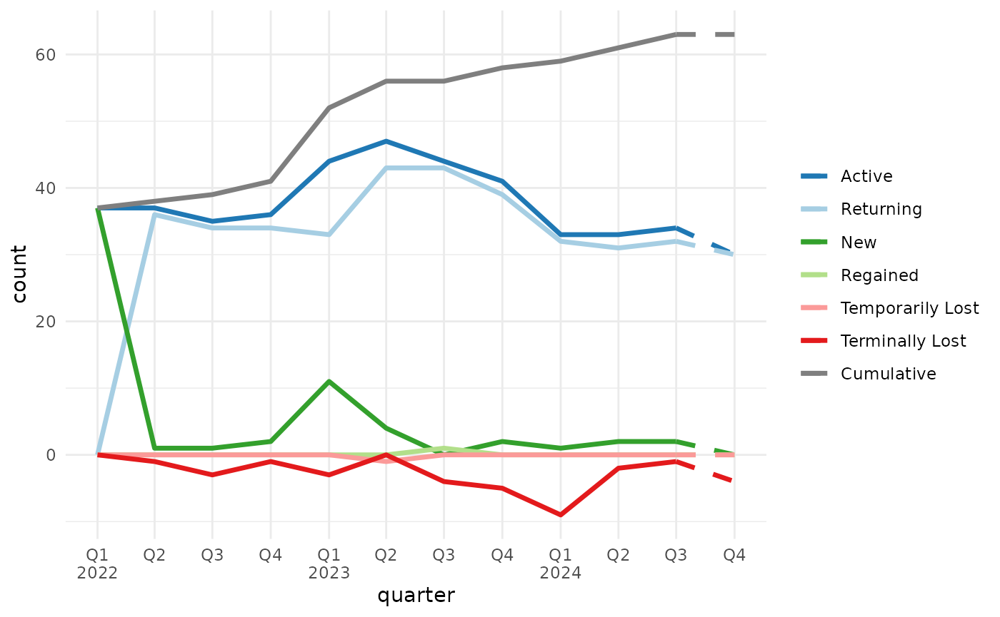

# mcrutils

``` r
library(mcrutils)
```

## Introduction

The goal of `mcrutils` is to provide a grab-bag of utility functions
that I find useful in my own R projects for data cleaning, analysis, and
reporting, including creating and visualizing year-to-date and quarterly
analyses, and customer account status/churn analysis.

## Cleaning

### Normalize logical columns

For data frames or tibbles that have character or factor columns storing
logical data, as may happen when reading from a database, CSV, or Excel
file, use
[`normalize_logicals()`](https://mcaselli.github.io/mcrutils/reference/normalize_logicals.md)
to find and convert these columns to logical type. This is a nice
one-liner in a `dplyr` pipe

``` r
library(dplyr, warn.conflicts = FALSE)
ugly_data <- tibble(
  logical_char = c("T", "F", "T"),
  logical_factor = factor(c("TRUE", "FALSE", "TRUE")),
  non_logical_char = c("a", "b", "c"),
  non_logical_factor = factor(c("x", "y", "z")),
  mixed_char = c("T", "F", "a"),
  mixed_factor = factor(c("TRUE", "FALSE", "x")),
  numeric_col = c(1.1, 2.2, 3.3)
)

ugly_data
#> # A tibble: 3 × 7
#>   logical_char logical_factor non_logical_char non_logical_factor mixed_char
#>   <chr>        <fct>          <chr>            <fct>              <chr>     
#> 1 T            TRUE           a                x                  T         
#> 2 F            FALSE          b                y                  F         
#> 3 T            TRUE           c                z                  a         
#> # ℹ 2 more variables: mixed_factor <fct>, numeric_col <dbl>
```

``` r
df <- ugly_data |> normalize_logicals()
#> Converted "logical_char" and "logical_factor" columns to
#> logical.
df
#> # A tibble: 3 × 7
#>   logical_char logical_factor non_logical_char non_logical_factor mixed_char
#>   <lgl>        <lgl>          <chr>            <fct>              <chr>     
#> 1 TRUE         TRUE           a                x                  T         
#> 2 FALSE        FALSE          b                y                  F         
#> 3 TRUE         TRUE           c                z                  a         
#> # ℹ 2 more variables: mixed_factor <fct>, numeric_col <dbl>
```

## Analysis

### Customer account status, churn, and retention

[`accounts_by_status()`](https://mcaselli.github.io/mcrutils/reference/accounts_by_status.md)
categorizes accounts into statuses based on their order activity
(active, new, returning, temporarily lost, regained and terminally lost)
in each time interval (monthly, weekly, quarterly, etc. are supported).
It also produces a running list of cumulative accounts. This is useful
for understanding customer retention and churn.

The `data.frame` returned by
[`accounts_by_status()`](https://mcaselli.github.io/mcrutils/reference/accounts_by_status.md)
quickly gets unwieldy to print, so to see how it works, let’s make a
small example data set with a list of 25 orders from 10 accounts over 6
months.

``` r
set.seed(1234)
n <- 25
dates <- seq(as.Date("2022-01-01"), as.Date("2022-06-30"), by = "day")
orders <- data.frame(
  account_id = sample(letters[1:10], n, replace = TRUE),
  order_date = sample(dates, n, replace = TRUE)
) |> arrange(order_date)

orders |> glimpse()
#> Rows: 25
#> Columns: 2
#> $ account_id <chr> "h", "b", "b", "f", "d", "i", "e", "c", "d", "d", "j", "f",…
#> $ order_date <date> 2022-01-02, 2022-01-26, 2022-02-10, 2022-02-11, 2022-02-12…
```

[`accounts_by_status()`](https://mcaselli.github.io/mcrutils/reference/accounts_by_status.md)
splits the order data by time periods, and returns the accounts in each
status category for each period as a list-column.

``` r
orders |> accounts_by_status(account_id, order_date, by = "month")
#>   period_start period_end              active              new returning
#> 1   2022-01-01 2022-01-31                b, h             b, h          
#> 2   2022-02-01 2022-02-28 b, c, d, e, f, i, j c, d, e, f, i, j         b
#> 3   2022-03-01 2022-03-31                d, f                       d, f
#> 4   2022-04-01 2022-04-30          d, e, g, h                g         d
#> 5   2022-05-01 2022-05-31             e, f, h                       e, h
#> 6   2022-06-01 2022-06-30                f, j                          f
#>   regained temporarily_lost terminally_lost                cumulative
#> 1                                                                b, h
#> 2                         h                    b, h, c, d, e, f, i, j
#> 3                      e, j         b, c, i    b, h, c, d, e, f, i, j
#> 4     e, h                f                 b, h, c, d, e, f, i, j, g
#> 5        f                             d, g b, h, c, d, e, f, i, j, g
#> 6        j                             e, h b, h, c, d, e, f, i, j, g
```

If you want the count of accounts in each status category, set
`with_counts = TRUE` (the lists of account_ids are still included, we
just omit them from the printed output here).

``` r
orders |>
  accounts_by_status(account_id, order_date, by = "month", with_counts = TRUE) |>
  select(period_start, starts_with("n_"))
#>   period_start n_active n_new n_returning n_regained n_temporarily_lost
#> 1   2022-01-01        2     2           0          0                  0
#> 2   2022-02-01        7     6           1          0                  1
#> 3   2022-03-01        2     0           2          0                  2
#> 4   2022-04-01        4     1           1          2                  1
#> 5   2022-05-01        3     0           2          1                  0
#> 6   2022-06-01        2     0           1          1                  0
#>   n_terminally_lost n_cumulative
#> 1                 0            2
#> 2                 0            8
#> 3                 3            8
#> 4                 0            9
#> 5                 2            9
#> 6                 2            9
```

Visualizing the count of accounts in each status over time can be
helpful to understand how the business is doing in terms of customer
retention and churn.

`mcrutils` includes a larger example dataset `example_sales` with about
5000 orders between accounts over in the 2022–2024 time period.

``` r
example_sales |> glimpse()
#> Rows: 5,317
#> Columns: 4
#> $ account_id    <chr> "l_10", "l_11", "l_20", "l_9", "l_1", "l_1", "l_18", "l_…
#> $ market        <chr> "Germany", "Germany", "United States", "United States", …
#> $ order_date    <date> 2022-01-02, 2022-01-03, 2022-01-03, 2022-01-03, 2022-01…
#> $ units_ordered <dbl> 1, 4, 2, 1, 3, 2, 2, 2, 1, 2, 3, 2, 2, 2, 2, 4, 4, 3, 1,…
```

[`accounts_by_status()`](https://mcaselli.github.io/mcrutils/reference/accounts_by_status.md)
produces six status counts, plus one cumulative count– that’s up to
seven data series to plot, so we need to be thoughtful about design
choices.

Showing the lost accounts as a negative value helps de-clutter the
picture and helps perception by encoding values above the axis as “good”
and below as “bad” (assuming we don’t want to lose customers). We can
use color to help as well (blues/greens: good, reds: bad).

``` r
library(ggplot2)
library(dplyr, warn.conflicts = FALSE)
library(tidyr)

example_sales |>
  accounts_by_status(account_id, order_date, with_counts = TRUE, by = "quarter") |>
  select(period_start, starts_with("n_")) |>
  # negate the lost counts for visualization
  mutate(across(contains("lost"), ~ -.x)) |>
  # pivot to prepare for ggplot
  pivot_longer(starts_with("n_"), names_to = "status", values_to = "count") |>
  mutate(status = stringr::str_remove(status, "n_")) |>
  ggplot(aes(period_start, count, color = status)) +
  geom_line(linewidth = 1.2) +
  scale_color_manual(values = c(
    "active" = "#1f78b4",
    "new" = "#33a02c",
    "returning" = "#a6cee3",
    "temporarily_lost" = "#fb9a99",
    "terminally_lost" = "#e31a1c",
    "regained" = "#b2df8a",
    "cumulative" = "#999999"
  )) +
  theme_minimal()
```



[`plot_accounts_by_status()`](https://mcaselli.github.io/mcrutils/reference/plot_accounts_by_status.md)
is a convenience function that does the above and a bit more, cleaning
up the legend, x-axis title, and if the last order_date is before the
end of the final time period (as in `example_sales`, which has no orders
after 2024-12-20), the final period will be shown with dashed lines to
indicate that the data may be incomplete.

``` r
example_sales |>
  plot_accounts_by_status(account_id, order_date, by = "quarter")
```



You can suppress the dashed lines for incomplete periods with with
`force_final_period_complete = TRUE`, and exclude the cumulative line
with `include_cumulative = FALSE`.

``` r
example_sales |>
  plot_accounts_by_status(
    account_id, order_date,
    by = "quarter",
    force_final_period_complete = TRUE,
    include_cumulative = FALSE
  )
```



### CAGR

[`mutate_cagrs()`](https://mcaselli.github.io/mcrutils/reference/mutate_cagrs.md)
adds columns with compound annual growth rates (CAGRs) for a vector of
values over specified time periods, optionally grouped by one or more
variables.

Here we’ll first aggregate the `example_sales` data to get monthly sales
volume by market, then use
[`mutate_cagrs()`](https://mcaselli.github.io/mcrutils/reference/mutate_cagrs.md)
to calculate 1-, 2-, and 3-month CAGRs for each market.

``` r
library(lubridate, warn.conflicts = FALSE)

example_sales |>
  group_by(
    market,
    month = lubridate::floor_date(order_date, unit = "month")
  ) |>
  summarize(
    volume = sum(units_ordered),
    .groups = "drop_last"
  ) |>
  mutate_cagrs(
    volume,
    month,
    group_vars = market,
    periods = c(1:3)
  ) |>
  # peek at the first 4 rows for each market
  slice_head(n=4, by = market)
#> # A tibble: 8 × 6
#>   market        month      volume volume_cagr_1 volume_cagr_2 volume_cagr_3
#>   <chr>         <date>      <dbl>         <dbl>         <dbl>         <dbl>
#> 1 Germany       2022-01-01     64        NA           NA            NA     
#> 2 Germany       2022-02-01    112         0.75        NA            NA     
#> 3 Germany       2022-03-01     71        -0.366        0.0533       NA     
#> 4 Germany       2022-04-01    107         0.507       -0.0226        0.187 
#> 5 United States 2022-01-01    206        NA           NA            NA     
#> 6 United States 2022-02-01    232         0.126       NA            NA     
#> 7 United States 2022-03-01    185        -0.203       -0.0523       NA     
#> 8 United States 2022-04-01    226         0.222       -0.0130        0.0314
```

### Business day evaluation

`mcrutils` provides several functions for working with business days,
including
[`is_bizday()`](https://mcaselli.github.io/mcrutils/reference/is_bizday.md),
[`adjust_to_bizday()`](https://mcaselli.github.io/mcrutils/reference/adjust_to_bizday.md),
[`bizdays_between()`](https://mcaselli.github.io/mcrutils/reference/bizdays_between.md),
[`periodic_bizdays()`](https://mcaselli.github.io/mcrutils/reference/periodic_bizdays.md),
and
[`bizday_of_period()`](https://mcaselli.github.io/mcrutils/reference/bizday_of_period.md).

These functions use calendars from QuantLib for working/non-working day
definitions, and they are all based on the
[qlcal](https://github.com/qlcal/qlcal-r) package. In fact, with the
exception of
[`periodic_bizdays()`](https://mcaselli.github.io/mcrutils/reference/periodic_bizdays.md),
there are corresponding functions in
[qlcal](https://github.com/qlcal/qlcal-r).

The motivation for the `mcrutils` versions was to facilitate frequent
changes to the configured QuantLib calendar without making persistent
changes to the globally configured calendar,i.e. these functions contain
the calendar change to their own functional scope.

This functionality leverages [withr](https://withr.r-lib.org).
`mcrutils` also provides
[`with_calendar()`](https://mcaselli.github.io/mcrutils/reference/set_cal.md)
and
[`local_calendar()`](https://mcaselli.github.io/mcrutils/reference/set_cal.md)
functions so you can leverage this side-effect encapsulation for other
`qlcal` use cases.

### Business days in periodic intervals

[`periodic_bizdays()`](https://mcaselli.github.io/mcrutils/reference/periodic_bizdays.md)
calculates the number of business days in each periodic interval (e.g.,
monthly, quarterly) between two dates, using calendars from QuantLib for
holiday definitions.

``` r
periodic_bizdays(
  from = "2025-01-01",
  to = "2025-12-31",
  by = "quarter",
  quantlib_calendars = c("UnitedStates", "UnitedKingdom")
)
#> # A tibble: 8 × 4
#>   calendar      start      end        business_days
#>   <chr>         <date>     <date>             <int>
#> 1 UnitedStates  2025-01-01 2025-03-31            61
#> 2 UnitedStates  2025-04-01 2025-06-30            63
#> 3 UnitedStates  2025-07-01 2025-09-30            64
#> 4 UnitedStates  2025-10-01 2025-12-31            62
#> 5 UnitedKingdom 2025-01-01 2025-03-31            63
#> 6 UnitedKingdom 2025-04-01 2025-06-30            61
#> 7 UnitedKingdom 2025-07-01 2025-09-30            65
#> 8 UnitedKingdom 2025-10-01 2025-12-31            64
```

### Cumulative daily sales by business day of period

[`bizday_of_period()`](https://mcaselli.github.io/mcrutils/reference/bizday_of_period.md)
calculates the business day of the period (month, quarter, or year) for
a given date and calendar e.g. date x is the 3rd business day of the
month.

This can be helpful in creating an apples-to-apples “burn-up” chart
showing cumulative orders, revenue, etc through the period vs. a similar
period in a prior year.

When there are multiple records per day, it’s generally faster to create
a lookup table from date to business day of period, and then join that
to your data frame.

Using the `example_sales` dataset, first we add a column with the
QuantLib calendar to be used for each order (in this case the market
column is close, we just need to eliminate the space in “United
States”).

``` r
library(dplyr, warn.conflicts = FALSE)
library(purrr)
library(stringr)

sales <- example_sales |>
  mutate(calendar = str_replace_all(market, " ", ""))

head(sales)
#> # A tibble: 6 × 5
#>   account_id market        order_date units_ordered calendar    
#>   <chr>      <chr>         <date>             <dbl> <chr>       
#> 1 l_10       Germany       2022-01-02             1 Germany     
#> 2 l_11       Germany       2022-01-03             4 Germany     
#> 3 l_20       United States 2022-01-03             2 UnitedStates
#> 4 l_9        United States 2022-01-03             1 UnitedStates
#> 5 l_1        Germany       2022-01-04             3 Germany     
#> 6 l_1        Germany       2022-01-04             2 Germany
```

Now we can make a lookup table covering the years and markets in our
data set.

``` r
bizday_lookup <- tibble(
  # make a row for each date in the years spanned by the sales data
  date = seq(
    from = lubridate::floor_date(min(sales$order_date), "month"),
    to = lubridate::ceiling_date(max(sales$order_date), "month") - 1,
    by = "day"
  )
) |>
  # cross with each calendar
  tidyr::expand_grid(calendar = unique(sales$calendar)) |>
  mutate(
    adjusted_date = purrr::map2_vec(
      .data$date, .data$calendar,
      \(date, calendar) adjust_to_bizday(date, calendar)
    ),
    # calculate the business day of month for each date in each market
    bizday_of_month = purrr::pmap_int(
      list(adjusted_date, .data$calendar),
      \(date, calendar) {
        bizday_of_period(date, calendar, period = "month")
      }
    ),
    # and again for the business day of quarter
    bizday_of_quarter = purrr::pmap_int(
      list(adjusted_date, .data$calendar),
      \(date, calendar) {
        bizday_of_period(date, calendar, period = "quarter")
      }
    )
  )

# peek at the result
bizday_lookup |>
  filter(date >= ymd("2023-07-02")) |> # starting on a Sunday in July
  head()
#> # A tibble: 6 × 5
#>   date       calendar     adjusted_date bizday_of_month bizday_of_quarter
#>   <date>     <chr>        <date>                  <int>             <int>
#> 1 2023-07-02 Germany      2023-07-03                  1                 1
#> 2 2023-07-02 UnitedStates 2023-07-03                  1                 1
#> 3 2023-07-03 Germany      2023-07-03                  1                 1
#> 4 2023-07-03 UnitedStates 2023-07-03                  1                 1
#> 5 2023-07-04 Germany      2023-07-04                  2                 2
#> 6 2023-07-04 UnitedStates 2023-07-05                  2                 2
```

Now we can join the lookup table to the sales data.

``` r
sales_with_bizday <- sales |>
  left_join(bizday_lookup, by = c("order_date" = "date", "calendar" = "calendar"))
head(sales_with_bizday)
#> # A tibble: 6 × 8
#>   account_id market        order_date units_ordered calendar     adjusted_date
#>   <chr>      <chr>         <date>             <dbl> <chr>        <date>       
#> 1 l_10       Germany       2022-01-02             1 Germany      2022-01-03   
#> 2 l_11       Germany       2022-01-03             4 Germany      2022-01-03   
#> 3 l_20       United States 2022-01-03             2 UnitedStates 2022-01-03   
#> 4 l_9        United States 2022-01-03             1 UnitedStates 2022-01-03   
#> 5 l_1        Germany       2022-01-04             3 Germany      2022-01-04   
#> 6 l_1        Germany       2022-01-04             2 Germany      2022-01-04   
#> # ℹ 2 more variables: bizday_of_month <int>, bizday_of_quarter <int>
```

Let’s imagine it’s mid-November 2024, and we want to see how orders are
tracking against the prior year.

First we group by the year and business day of month, then calculate
daily units ordered and the cumulative sum of units ordered

``` r
global_cum_daily_sales <- sales_with_bizday |>
  filter(order_date < ymd("2024-11-18")) |>
  filter(month(adjusted_date) == 11) |>
  group_by(year = year(adjusted_date), bizday_of_month) |>
  summarise(units_ordered = sum(units_ordered), .groups = "drop") |>
  group_by(year) |>
  mutate(cumulative_units_ordered = cumsum(units_ordered)) 

head(global_cum_daily_sales)
#> # A tibble: 6 × 4
#> # Groups:   year [1]
#>    year bizday_of_month units_ordered cumulative_units_ordered
#>   <dbl>           <int>         <dbl>                    <dbl>
#> 1  2022               1            24                       24
#> 2  2022               2            10                       34
#> 3  2022               3            15                       49
#> 4  2022               4            15                       64
#> 5  2022               5            19                       83
#> 6  2022               6             8                       91
```

Now we can construct a cumulative daily sales chart comparing 2024 to
prior years.

``` r
global_cum_daily_sales |>
  ggplot(aes(bizday_of_month, cumulative_units_ordered, color = factor(year))) +
  geom_line(linewidth = 1.2) +
  labs(
    title = "Cumulative Units Ordered by Business Day of Month",
    color = "Year"
  ) +
  theme_minimal()
```



Or we can look by-market as well, we just need to add another grouping
variable for the market, then facet the plot.

``` r
regional_cum_daily_sales <- sales_with_bizday |>
  filter(order_date < ymd("2024-11-18")) |>
  filter(month(order_date) == 11) |>
  group_by(year = year(order_date), bizday_of_month, market) |>
  summarise(units_ordered = sum(units_ordered), .groups = "drop") |>
  group_by(year, market) |>
  mutate(cumulative_units_ordered = cumsum(units_ordered)) 

head(regional_cum_daily_sales)
#> # A tibble: 6 × 5
#> # Groups:   year, market [2]
#>    year bizday_of_month market        units_ordered cumulative_units_ordered
#>   <dbl>           <int> <chr>                 <dbl>                    <dbl>
#> 1  2022               1 Germany                   7                        7
#> 2  2022               1 United States            17                       17
#> 3  2022               2 Germany                   3                       10
#> 4  2022               2 United States             7                       24
#> 5  2022               3 Germany                   2                       12
#> 6  2022               3 United States            13                       37
```

``` r
regional_cum_daily_sales |>
  ggplot(aes(bizday_of_month, cumulative_units_ordered, color = factor(year))) +
  geom_line(linewidth = 1.2) +
  facet_wrap(~market, ncol=1) +
  labs(
    title = "Cumulative Units Ordered by Business Day of Month",
    color = "Year"
  ) +
  theme_minimal()
```



### Year-to-date helpers

`mcrutils` provides a handful functions that can be helpful in creating
year-to-date analyses

Below we have 2.5 years of historical sales data ending on June 1, 2025.

``` r
set.seed(123)
sales <- tibble(
  date = seq(
    from = as.Date("2023-01-01"),
    to = as.Date("2025-06-01"),
    by = "month"
  ),
  amount = rpois(30, lambda = 100)
)

head(sales)
#> # A tibble: 6 × 2
#>   date       amount
#>   <date>      <int>
#> 1 2023-01-01     94
#> 2 2023-02-01    111
#> 3 2023-03-01     83
#> 4 2023-04-01    101
#> 5 2023-05-01    117
#> 6 2023-06-01    104
```

[`ytd_bounds()`](https://mcaselli.github.io/mcrutils/reference/ytd_bounds.md)
gets the start and end of the year-to-date period for the latest year in
a vector of dates,

``` r
(bounds <- ytd_bounds(sales$date))
#> [1] "2025-01-01" "2025-06-01"
```

and
[`is_ytd_comparable()`](https://mcaselli.github.io/mcrutils/reference/is_ytd_comparable.md)
is a logical vector that indicates whether the dates in a vector are
within a year-to-date period relative to a given `end_date`.

So we can quickly filter the historical data to see how we’re doing in
2025 compared to the same period (i.e. January - June) in 2023 and 2024:

``` r
sales |>
  filter(is_ytd_comparable(date, max(bounds))) |>
  group_by(year = lubridate::year(date)) |>
  summarise(ytd_sales = sum(amount))
#> # A tibble: 3 × 2
#>    year ytd_sales
#>   <dbl>     <int>
#> 1  2023       610
#> 2  2024       594
#> 3  2025       600
```

With
[`py_dates()`](https://mcaselli.github.io/mcrutils/reference/py_dates.md)
you can rollback a vector of dates to the same period in the previous
year, moving any fictitious dates to the prior valid day.

``` r
c("2024-01-01", "2024-02-29", "2025-07-15") |>
  as.Date() |>
  py_dates()
#> [1] "2023-01-01" "2023-02-28" "2024-07-15"
```

## Visualization

### Auto-formatted datattables

[`auto_dt()`](https://mcaselli.github.io/mcrutils/reference/auto_dt.md)
uses
[`guess_col_fmts()`](https://mcaselli.github.io/mcrutils/reference/guess_col_fmts.md)
to determine the format of each column. You can provide `pct_flags` and
`curr_flags` (character vectors) if you need to control the list of
“signal” words that indicate a column is a percentage or currency.

You can suppress the buttons for copy, csv, and excel downloads with
`buttons = FALSE`.

``` r
tribble(
  ~product, ~weight, ~dollaz_earned, ~growth_pct,
  "Widget A", 13.53, 1023.21, 0.051,
  "Widget B", 22.61, 150.24, 0.103,
  "Widget C", 40.54, 502.26, 0.021,
  "Widget D", 34.21, 2000.95, 0.154
) |>
  mutate(product = as.factor(product)) |>
  auto_dt(numeric_digits = 1, pct_digits = 0, curr_flags = c("revenue", "dollaz"))
```

### Quarterly breaks and labels

[`scales::label_date_short()`](https://scales.r-lib.org/reference/label_date.html)
is a great function for labeling dates in `ggplot2`, but unfortunately
it can’t support quarterly breaks and labels out of the box.

`mcrutils` provides a set of functions to create quarterly breaks and
labels for date scales in `ggplot2`. The
[`breaks_quarters()`](https://mcaselli.github.io/mcrutils/reference/breaks_quarters.md)
function generates breaks for quarters, and
[`label_quarters_short()`](https://mcaselli.github.io/mcrutils/reference/label_quarters_short.md)
generates minimal labels for these breaks in a two-line format (like
[`scales::label_date_short()`](https://scales.r-lib.org/reference/label_date.html)),
labeling every quarter, but only including the year when it changes from
the previous label.

``` r
library(ggplot2)

economics |>
  filter(date >= "2005-05-01", date <= "2007-03-01") |>
  ggplot(aes(date, pce)) +
  geom_line() +
  scale_x_date(
    breaks = breaks_quarters(),
    labels = label_quarters_short()
  ) +
  labs(
    title = "Automatic Quarterly Breaks",
    subtitle = "with concise labels"
  ) +
  theme(panel.grid.minor.x = element_blank())
```



The automatic version of
[`breaks_quarters()`](https://mcaselli.github.io/mcrutils/reference/breaks_quarters.md)
tries to return a reasonable number of breaks over a wide range of
dates, down-sampling to semesters and years as needed.

``` r
economics |>
  filter(date >= "2005-05-01", date <= "2009-03-01") |>
  ggplot(aes(date, pce)) +
  geom_line() +
  scale_x_date(
    breaks = breaks_quarters(),
    labels = label_quarters_short()
  ) +
  labs(
    title = "Switching to semesters for longer ranges",
    subtitle = "always labelling Q1/Q3, never Q2/Q4"
  ) +
  theme(panel.grid.minor.x = element_blank())
```



``` r
economics |>
  filter(date >= "2000-05-01", date <= "2010-03-01") |>
  ggplot(aes(date, pce)) +
  geom_line() +
  scale_x_date(
    breaks = breaks_quarters(),
    labels = label_quarters_short()
  ) +
  labs(
    title = "Switching to yearly for very long ranges",
    subtitle = "rather silly"
  ) +
  theme(panel.grid.minor.x = element_blank())
```



With very long date ranges like this, you are likely better off
switching from these quarterly functions to the more standard date
breaks and labels in `ggplot2`.

You can force a fixed break width if quarters are desired regardless of
the date range.

``` r
example_sales |>
  plot_accounts_by_status(account_id, order_date, by = "quarter") +
  scale_x_date(
    breaks = breaks_quarters(width = "1 quarter"),
    labels = label_quarters_short()
  ) +
  theme(panel.grid.minor.x = element_blank())
```


